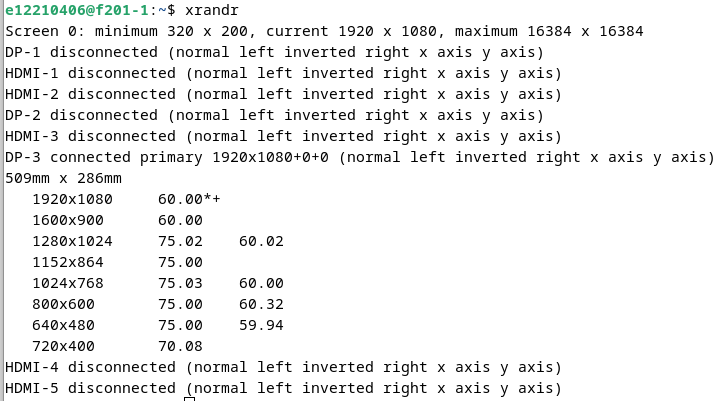

# Linux — System Inspection Script

A Bash exercise for collecting host identification, processor information and memory usage.



*Display configuration inspected with xrandr during the Linux exercise.*

## Implementation

[`info_machine.sh`](info_machine.sh) uses `uname`, `lscpu` and `free -h`. Its output is appended to a relative `syst_info.txt` file.

Repeated executions accumulate output because the script uses append redirection. The file is created in the current working directory.

## Running

Review the script, then run:

```bash
bash info_machine.sh
cat syst_info.txt
```

A Linux environment with Bash and the corresponding utilities is required. Inspect the generated information before sharing it.

## Supporting material

[`assets/`](assets/) contains screenshots from package and display-tool exploration. These are archived exercise captures, not a current inventory of the reader's machine.

## Validation and licence

The generated report combines host identity with CPU and memory state at the time of execution. No project-wide licence has been defined.
